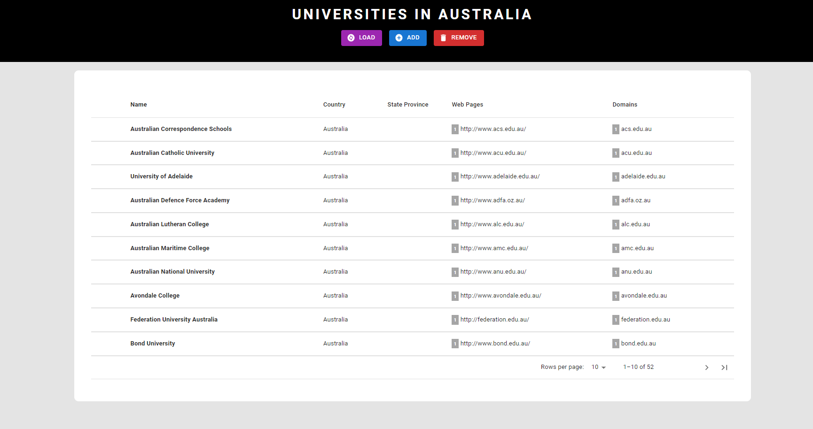
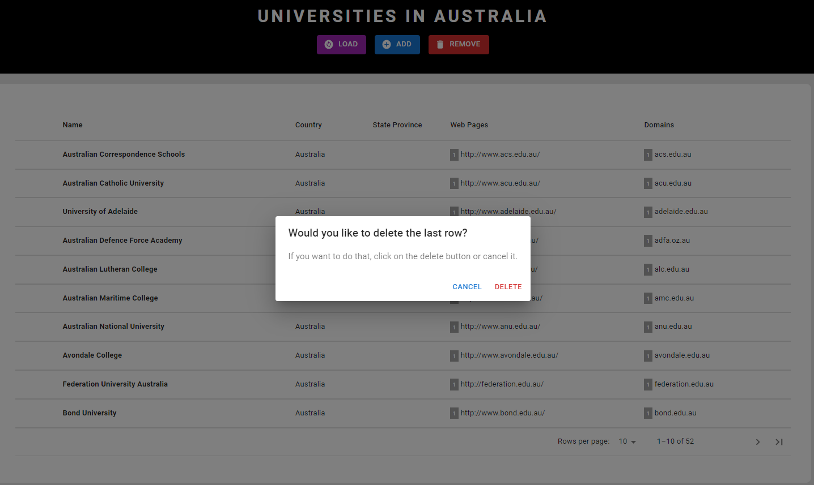

# LoanOptions.ai - Task 1 (ReactJs)

In this project, I have created a ReactJs application that gets data from an API, and display the data retrieved in a table.





## How to run it?

### ReactJs

<details><summary><b>Show instructions</b></summary>

1. Access the folder of the project via the terminal, or an IDE that enables prompt commands

2. Install the required packages by using the command below:

    ```sh
    $ npm install
    ```

2. Now, you can start the project in the development env by using the below command.

    ```sh
    $ npm run dev
    ```
After that, the program should run in the localhost.

</details>

## Website
 
You can access the project website via this link <a href="https://loan-option-ai-task1-234pm55h7-andre2553.vercel.app/">https://loan-option-ai-task1-234pm55h7-andre2553.vercel.app/</a>

Unfortunately, the api used for the task uses http protocol, so it is unsafe.
##

For you to be able to use the application, you need to change the privacy and security > Insecure content = Allow

<details><summary><b>Show instructions</b></summary>

1. Go to the website's information section by clicking on the lock icon > site settings

2. Scroll down to the "insecure content" and choose "allow" from the dropdown

3. Refresh your page and you're good to go

</details>

##

Please feel free to contact me if you have any questions.

email: andre_rodrigueslima@outlook.com.au


